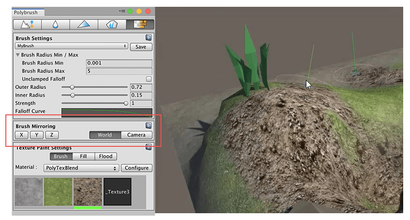
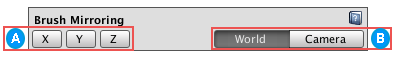

# Brush mirroring

You can use this feature to control up to eight brushes in the Scene simultaneously.

## Options

 Choose which axis or axes to mirror the brush on (**X**, **Y**, or **Z**). You can disable all axes for no mirroring, or enable any number of axes.

 Set which coordinate space to use. If you choose **World** space, Polybrush mirrors the brush across the World axis. This means that the axes are always the same, matching Unity's world coordinates.

If you choose **Camera** space, Polybrush uses the Scene Camera's Transform: 

* x = left/right
* y = up/down
* z = forward/back