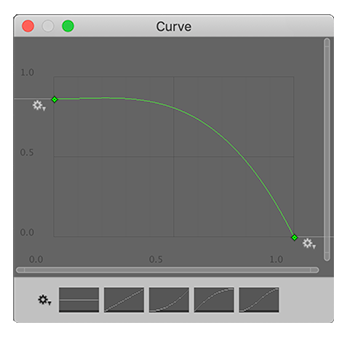

# Brush Settings

These settings determine how a brush affects Meshes.

 

 Choose one of the saved brush presets from the brush preset drop-down menu. 

 Select the **Save** button to save the current brush settings as a new Preset, or overwrite an existing Preset.

 Set the maximum and minimum radius for the current brush with the **Brush Radius Min / Max** settings. Select the arrow icon () to toggle between expanding and collapsing these settings:

| **Property**          | **Description**                                              |
| --------------------- | ------------------------------------------------------------ |
| **Min**               | Set the minimum value the **Outer Radius** and **Inner Radius** sliders allow. |
| **Max**               | Set the maximum value the **Outer Radius** and **Inner Radius** sliders allow. |
| **Unclamped Falloff** | Enable this property to extend the brush falloff past the limit of the outer radius. |

 Set the outer limit of the brush, where it's effect becomes 0%. The **Outer Radius** is the full radius of the brush, that the values in the **Brush Radius Min / Max** section limit. This appears as a light-colored outer ring. 

The shortcut for this setting is Ctrl + rotate wheel (Command + rotate wheel on macOS).

 Set the zone of 100% effect for the brush. Everything inside the **Inner Radius** gets the full brush effect (for example, to create hard vs. soft brushes). This appears as a bright blue inner ring.

The shortcut for this setting is Shift + rotate wheel.

 Set the **Strength** value to control the brush's maximum effect: 

* When painting colors or textures, this setting controls Opacity. 
* When sculpting geometry, this setting corresponds to a percentage of the [Sculpt Power](modes_sculpt.md#power). 

The shortcut for this setting is Ctrl + Shift + rotate wheel (Command + Shift + rotate wheel on macOS).

 Set the **Falloff Curve** to control exactly how the brush fades from full (**Inner Radius**) to zero (**Outer Radius**). To modify the curve, select the curve image. The Unity **Curve** editor opens:

 

For information on how to use this window, see the documentation on [Editing Curves](https://docs.unity3d.com/Documentation/Manual/EditingCurves.html).