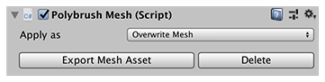
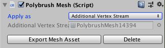
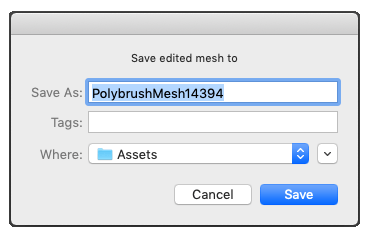

# Polybrush Mesh component

Polybrush adds the **Polybrush Mesh** component to the GameObject as soon as you select a Brush mode and hover over the Unity or ProBuilder Mesh.

A Mesh is a list of vertices and faces that define the shape of the GameObject. The Polybrush Mesh component captures every change you make to the Mesh. This means that Polybrush can store extra data not saved in the standard Mesh object.

Usually the Polybrush Mesh replaces (overwrites) the standard Mesh component in the GameObject's [Mesh Filter](https://docs.unity3d.com/Manual/class-MeshFilter.html). However, if you prefer, you can keep the standard Mesh component in the Mesh Filter and send the Polybrush Mesh data to the renderer through its [MeshRenderer.additionalVertexStreams](https://docs.unity3d.com/ScriptReference/MeshRenderer-additionalVertexStreams.html) property. For example, this can be very useful if you have imported a Model from a 3D modeling software and you want to keep the vertex color data completely separate from the imported Mesh data.

For more information about how the Unity Additional Vertex Streams feature works in general, see the documentation for the [MeshRenderer.additionalVertexStreams](https://docs.unity3d.com/ScriptReference/MeshRenderer-additionalVertexStreams.html) property in the Unity Scripting API manual.

 

## Applying the Polybrush Mesh 

You can use the [Apply as](#apply-as) property to specify whether you want to use the **Overwrite Mesh** or the **Additional Vertex Stream** method individually for each Polybrush Mesh component. 

Select one of these options from the __Apply as__ drop-down menu:

| **Option**                   | **Description**                                              |
| ---------------------------- | ------------------------------------------------------------ |
| __Additional Vertex Stream__ | Use an **Additional Vertex Streams** Mesh to write Polybrush data. |
| __Overwrite Mesh__           | Use the **Polybrush Mesh Component** to write Polybrush data to the [Mesh Filter](https://docs.unity3d.com/Manual/class-MeshFilter.html) directly. |

When you choose the **Additional Vertex Stream** option, the __Additional Vertex Streams__ reference property appears in the Inspector window of the Polybrush Mesh Component:

 

You can also choose one of these methods to use by default on all new Polybrush Mesh components with the [Use Additional Vertex Streams](prefs.md#avs) default preference. 

## Saving Polybrush Mesh data to an external file

You can save the Polybrush Mesh data to an external file, as a way to back up the changes you make. However, this file is not linked to the Polybrush Mesh data, so if you make changes after saving the file, you have to save the file again.

When you click the __Export Mesh Asset__ button in the Polybrush component, a dialog appears where you can indicate where to save the new Mesh:

 

## Removing the Polybrush Mesh component

Select the __Delete__ button on the Polybrush Mesh component to remove the component from the GameObject and revert all changes made with Polybrush. If you were using the [Overwrite Mesh](#apply-as) method, Polybrush restores the original Mesh object in the Mesh Filter.

> **Note:** Only remove this component if you are sure you no longer want to use Polybrush data. If you just want to "clean" a GameObject before you build your application, use [Export Mesh Asset](#exporting) instead.