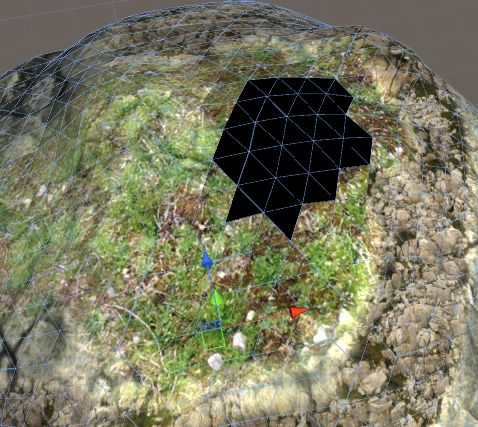

# Troubleshooting

[Placeholder text from previous documentation]

Frequently asked questions and troubleshooting tips when working with **Polybrush**.

---

## Brush Isn't Applying / Can't See Brush Gizmo

- First, make sure you have a **Brush Mode** selected (click any of the buttons in the top toolbar except settings).

	This is usually the cause, since **Polybrush** automatically pops out of **Brush Mode**s when the Unity tool is changed.

- Check that you have a GameObject selected, and that the selected GameObject has a valid mesh.  **Polybrush** only applies brushes to the current selection, and must have a mesh with a vertex count greater than 3.

- **Polybrush** does not work on Unity Terrain objects.  Make sure the GameObject is a mesh.

- Reset the **Brush Settings** by deleting the *ProCore/Polybrush/Brush Settings* folder.  Note that this will clear any saved brush presets, so use this only as a last resort!

## Save Mesh as Asset

**Polybrush** adds a new button to `MeshFilter` components that reference an instanced mesh (a mesh that isn't saved in the project).  The "Save to Asset" button will create a new mesh asset in your project and point the `MeshFilter` to that object.  This allows the mesh to be used in Prefabs.

## Prefabs aren't working

See [Save Mesh as Asset](#save-mesh-as-asset).

## Colors or Textures not Painting

Vertex colors and texture blending both require special shaders to work.  By default, Unity's Standard shader does not include support for either of these modes.  Fortunately, **Polybrush** includes a number of prebuilt Materials that work well with these modes:

| Name                               | Mode    | Description                                                                                                                             | Path                                                         |
| -                                  | -       | -                                                                                                                                       | -                                                            |
| **Diffuse Vertex Color**           | Color   | A Legacy Diffuse shader with support for a texture, normal map, and vertex colors.                                                      | *ProCore/Polybrush/Materials/Diffuse Vertex Color*           |
| **Standard Texture Blend**         | Texture | A PBR enabled material with support for blending up to 12 different textures.                                                           | *ProCore/Polybrush/Materials/Standard Texture Blend*         |
| **Standard Texture Blend Bump**    | Texture | A PBR enabled material with support for blending up to 4 different textures with normal maps.                                           | *ProCore/Polybrush/Materials/Standard Texture Blend Bump*    |
| **Standard Vertex Color**          | Color   | This material behaves similarly to the Standard shader, but with support for painting vertex colors.                                    | *ProCore/Polybrush/Materials/Standard Vertex Color*          |
| **TriPlanar Texture Blend**        | Texture | A PBR enabled material with support for blending up to 4 textures and automatically projects UV coordinates.                            | *ProCore/Polybrush/Materials/TriPlanar Texture Blend*        |
| **TriPlanar Texture Blend Legacy** | Texture | A Blinn-Phong lighting pipeline (legacy) material with support for blending up to 4 textures and automatically projects UV coordinates. | *ProCore/Polybrush/Materials/TriPlanar Texture Blend Legacy* |
| **Unlit Texture Blend**            | Texture | A simple unlit material with support for blending up to 6 textures.                                                                     | *ProCore/Polybrush/Materials/Unlit Texture Blend*            |

## Textures not Painting (with valid shader)

Occasionally Unity will refuse to update mesh values after a lightmap bake.  To fix, open `Window > Lighting > Scene` and click the arrow on the Build button in the bottom right corner then select "Clear Baked Data".

## Keyboard Shortcuts Not Working

Unity can sometimes not register keyboard shortcuts when a package is first imported.  The solution to open the Menu item and manually select the shortcut.  You should only need to do this once ever.

## Lighting Seams or Vertex Color / Textures Bleeding

For vertex colors and textures to have hard seams (meaning no blending at vertices between different colored faces) a mesh must have hard edges.  Most 3D modeling applications call this some variation on "Smooth" or "Hard" edges.

This can also affect lighting - if an edge is not smoothed then using the **Push/Pull** or **Smooth** brush tools can exacerbate a lighting seam.

## Black Faces / Triangles on Mesh

This can happen when a Texture Blending material is in use, but no texture channels have been applied to the mesh.  To fix, open the **Texture Blend Mode** panel and select a texture, then apply the brush to the affected areas.

In some cases you may also need to use **Vertex Color Mode** to paint the entire mesh with a **White** color.
