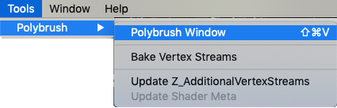
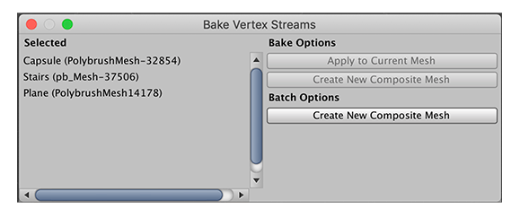

# Menu options

The Polybrush menu is available from the main Unity **Tools** menu and provides access to most of the Polybrush features.

The following features are available from this menu:

| **Menu item**                        | **Description**                                              |
| ------------------------------------ | ------------------------------------------------------------ |
| **Polybrush Window**                 | Opens the [Polybrush window](index.md#interface), which you can use to select and customize [brush modes](modes.md), change the brush [size and intensity](brushes.md), and choose any [mirroring options](brush_mirror.md). |
| **Bake Vertex Streams**              | Opens the **Bake Vertex Streams** window which lists the Polybrush Mesh data for the selected GameObject on the **Selected** pane. You can then specify what to do with this data in the **Bake Options** pane.     **Note:** This feature has been deprecated and will be removed in future versions of the package. |
| **Update Z_AdditionalVertexStreams** | Converts all obsolete **Z_AdditionalVertexStreams** components to **Polybrush Mesh** components in batch. You can run this after upgrading from versions of Polybrush prior to v1.0. For more information, see [Converting Additional Vertex Streams](index.md#batch-avs). |
| **Update Shader Meta**               | Moves the configuration data for Texture blending Shaders from the obsolete *.pbs.json* files to the Shader's *.meta* file. You can run this after upgrading from versions of Polybrush prior to v1.0. For more information, see [Updating Shader configurations](index.md#shader-meta). |

