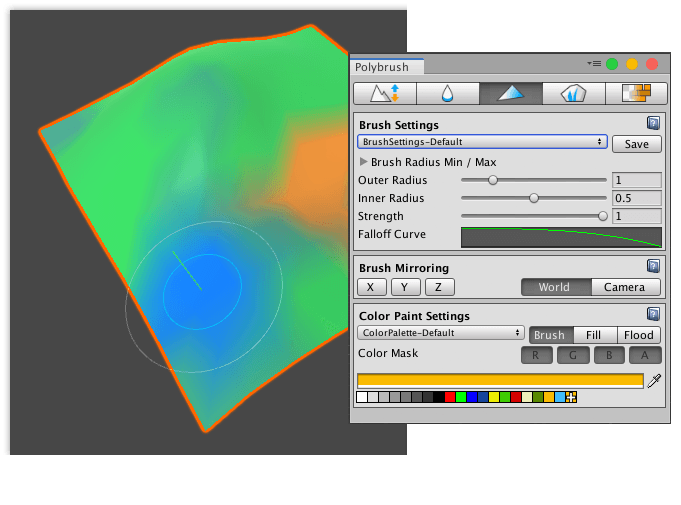
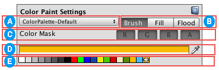

# Painting Colors on a Mesh

Use the Paint mode to set the vertex colors on a Mesh with a brush or a paint bucket.  You can use the toolbar under the [Color Paint Settings](#props) section to choose **Brush**, **Fill**, or **Flood**.

To apply vertex colors on a Mesh, you need to apply a Material that supports vertex colors.  For more information on working with Materials that support custom Shaders, see the following topics:

* [Creating and Using Materials](https://docs.unity3d.com/Manual/Materials.html) for Unity's built-in render pipeline.
* [Getting started with LWRP](https://docs.unity3d.com/Packages/com.unity.render-pipelines.lightweight@latest) (Lightweight Render Pipeline) if you are using a version of the Unity Editor prior to 2019.3 or [Getting started with URP](https://docs.unity3d.com/Packages/com.unity.render-pipelines.universal@latest) (Universal Render Pipeline) if you are using Unity 2019.3 or later.
* [Getting started with High Definition Render Pipeline](https://docs.unity3d.com/Packages/com.unity.render-pipelines.high-definition@latest) (HDRP).

If you hover over a Mesh with an incompatible Shader, Polybrush displays a warning.

Most default Unity Shaders do not support vertex colors, but Polybrush comes with sample Shaders which you can import into your Project. For more information, see [Importing Polybrush Shaders](index.md#import-shaders).

Once your Mesh has the proper Material, you can paint vertex colors on it:

1. Select the Mesh object you want to paint.

2. Click the **Paint vertex colors on meshes** icon in the Mode toolbar to activate the Paint mode.

3. To customize the radius, falloff, and strength (intensity) of the brush, modify the properties under the [Brush Settings](brushes.md) section.

	> **Note**: The Brush Settings affect the actual color that Polybrush applies to vertices. For more information, see the [Brush Settings](brushes.md) documentation.

4. To mirror the changes you are applying, set the axes and reference in the [Brush Mirroring](brush_mirror.md) section.

5. To customize the Color tool, modify any of the options in the [Color Paint Settings](#props) section, which are only available in this mode.

6. Select a color swatch from the the current palette () under the [Color Paint Settings](#props) section.

7. To paint, hover over the Mesh and left-click where you want to apply the selected color.

8. To erase existing vertex colors, hover over the Mesh and hold down the Ctrl key (Command key on macOS) while left-clicking.

## Color Paint Settings

 You can select a different color palette from the drop-down menu. Polybrush provides a default color palette, but you can create a new custom palette yourself.

To create your own color palette:

* Select **Add Palette** from the Palettes drop-down menu, then reorder or delete the swatches. For details, see the information in the color palette () section below.

 Brush style toolbar. Click one of the following buttons to select the way you want Polybrush to apply the colors:

| **Button application method** | **Description** |
| ---| --- |
| **Brush** | Standard brushing style: Polybrush applies colors smoothly across vertices. |
| **Fill** | Polybrush completely fills in the faces that you select. To see a preview of which face Polybrush will fill, hover over the Mesh. |
| **Flood** | Polybrush fills the entire Mesh. |

 You can selectively modify color values by channel (**R**, **G**, **B**, **A**).  When you enable a channel, its toggle button appears with a darker background to indicate that it is active. By default, the brush affects all color channels at once.  

Disable the channels that you want Polybrush to leave alone when it modifies the Mesh. For example, if you disable the **R** to paint on a Mesh using RGB(255,20,50), the brush paints (0,20,50).

 Shows the brush color that Polybrush applies.

To select a new brush color, either click an element in the **Current Color Palette** or pick a new color from the color picker control.

> **Note**: The final color the brush applies also depends on the [Strength](brushes.md#strength) property in the **Brush Settings** section, and the underlying Mesh color.

 The color palette displays color swatches that provide quick access to brush colors.  You can add, remove, or change colors in this list at any time:

* To choose a color for painting, click on a swatch icon.
* To move and reorder swatches, drag the swatch icons.
* To delete swatches, click on a swatch icon and a trash can icon appears. Drag the swatch onto the trash can icon to delete it.
* To add the current color to the list of swatches, click the Add icon (**+**) at the end of the swatch row.

> **Note**: Polybrush immediately auto-saves any changes to the current palette.
