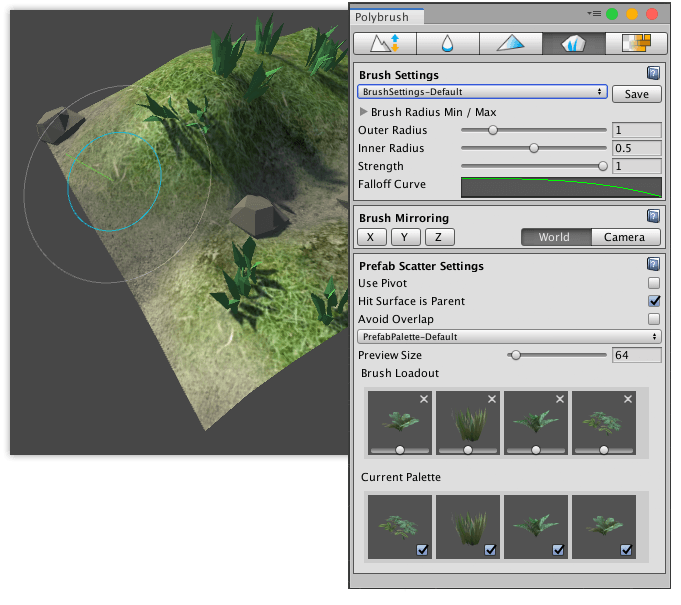
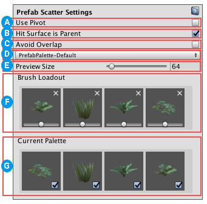

# Scattering Prefabs

You can use the **Scatter** mode to "paint" Prefabs onto a Mesh. This is similar to painting Texture details (such as grass and rocks) with [the Terrain tools](https://docs.unity3d.com/Documentation/Manual/terrain-PaintTexture.html).

1. Select the Mesh object you want to place Prefabs on.

2. Click the **Scatter Prefabs on meshes** () icon in the Mode toolbar to activate the Scatter mode.

3. To customize the radius, falloff, and strength (intensity) of the brush, modify the properties under the [Brush Settings](brushes.md) section.

4. To mirror the changes you are applying, set the axes and reference in the [Brush Mirroring](brush_mirror.md) section.

5. To customize the Scatter tool, modify any of the options under the [Prefab Scatter Settings](#props) section, which are only available in this mode.

6. Drag and drop the Prefabs into the **Current Palette** under the [Prefab Scatter Settings](#props) section and make sure you select (check) the Prefabs you want to use.

7. Click on a Prefab in the **Brush Loadout** area in the [Prefab Scatter Settings](#props) section to select it.

	> **Tip:** To select more than one Prefab at once, hold down the Shift key while you select them.

8. To paint, hover over the Mesh and left-click where you want to apply the selected Prefab(s).

9. To erase the currently selected Prefab, hover over the Mesh and hold the Ctrl key (Command key on macOS) while left-clicking.

## Prefab Scatter Settings

 Enable the **Use Pivot** property to place Prefabs with their pivot points on the surface of the Mesh. This is enabled by default.

Disable this property if you want Polybrush to place Prefabs with their center on the surface.

 Enable the **Hit Surface is Parent** property to place Prefabs as children of the surface GameObject. This is enabled by default.

Disable this property if you want Polybrush to place Prefabs at the Scene root, with no parent GameObject.

 Enable the **Avoid Overlap** property if you want Polybrush to avoid placing Prefabs where they might overlap with others. This is enabled by default.

Disable this property if you want Polybrush to ignore potential overlaps when placing Prefabs.

 You can select a different Prefab palette from the drop-down menu. Polybrush provides a default Prefab palette, but you can create a new custom palette yourself.

To create your own Prefab palette:

* Select **Add Palette** from the Palettes drop-down menu, then you can reorder the Prefabs or move a Prefab into the trash can. For details, see the information in the [Current palette (swatches)](#swatches) section below.

 Change the **Preview Size** value to adjust the size of the Prefab preview.

 The **Brush Loadout** provides quick access to the Prefabs that are available to place on your Mesh. To control which Prefabs appear on this panel, load Prefabs on the **Current Palette** and enable them.

 Save and load sets of Prefabs for future use using the **Current Palette**. You can add, remove, or change Prefabs in this list at any time:

- To add Prefabs, drag them onto a slot.
- To make a Prefab available in the **Brush Loadout** section, make sure you select (check) it in the Current Palette section. To select multiple Prefabs at once, hold down the Shift key while clicking.
- To remove a Prefab, select a Prefab slot and press the Backspace key.
