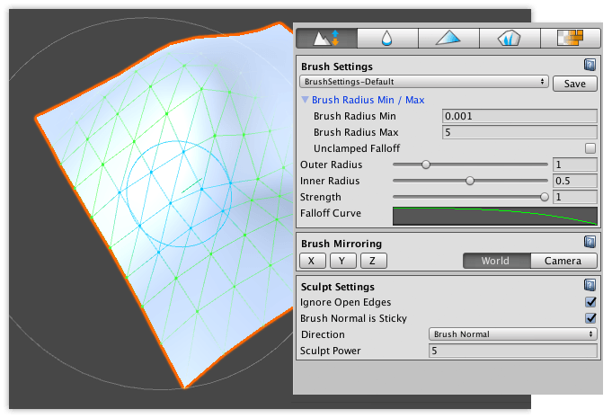
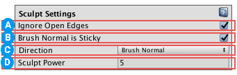
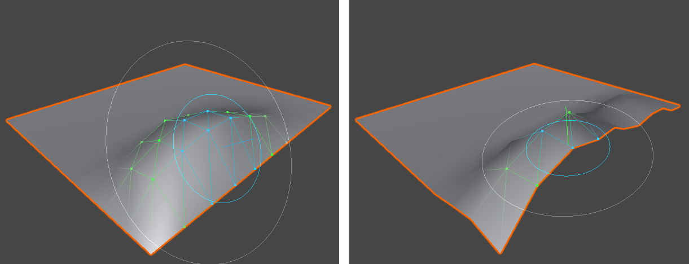

# Mesh Sculpting

Use the **Sculpt** tool to push and pull vertices, to shape the Mesh.

To use the Sculpt tool:

1. Select the Mesh object you want to sculpt.
2. Select the **Sculpt on meshes**  icon in the Mode toolbar to activate Sculpt mode.
3. To customize the radius, falloff, and strength (intensity) of the brush, modify the properties under the [Brush Settings](brushes.md) section.
4. To mirror the changes you are applying, set the axes and reference under the [Brush Mirroring](brush_mirror.md) section.
5. To customize the Sculpt tool, modify any of the options under the [Sculpt Settings](#props) section, which are only available in this mode.
6. Click and drag while hovering over the selected Mesh. Dragging with the left mouse button simulates "pulling" geometry, and dragging with the right mouse button simulates "pushing" geometry

> **Tip:** To invert the movement direction, hold the Ctrl key (Command key on macOS) while dragging the left mouse button. Up then becomes down, and right becomes left.

## Sculpt Settings

 When the **Ignore Open Edges** property is enabled, Polybrush ignores any vertices on the edge of the Mesh. This property is enabled by default.

Disable this property if you want Polybrush to modify all vertices within the radius of the brush. The following image demonstrates the difference:

 When the **Brush Normal is Sticky** property is enabled, Polybrush "sticks" with the normal it starts with, and continues with that direction. This property is enabled by default.

Disable this property if you want Polybrush to continually sample for normals as it sculpts.

Choose how to push or pull the vertices under the brush from the **Direction** drop-down menu. You can choose from these options:

| **Value** | **Description** |
| ---| --- |
| **Brush Normal** | Move vertices in the brush's "up" direction. When the brush hovers over a surface, Polybrush samples the normal of that surface and uses it for Brush Normal.  This is the default behavior.  **Note**: The **Brush Normal is Sticky** property determines whether to keep this normal direction until the next stroke, or to sample a new normal every frame of the stroke. |
| **Vertex Normal** | Vertices move in their own inward or outward directions, which Polybrush always recalculates at each frame. This usually results in an inflated or deflated appearance. |
| **Global Y Axis** | Move vertices on the y-axis only (up). |
| **Global X Axis** | Move vertices on the x-axis only (right). |
| **Global Z Axis** | Move vertices on the z-axis only (forward). |

> **Tip**: Use **Vertex Normal** on objects like spheres where you want the movement to be relative to the direction of the affected vertices.

 Use the **Sculpt Power** property to set the maximum distance in units (which generally means meters in Unity) to push or pull vertices per frame. Higher values mean more movement, and smaller values mean less movement.  Hold the Ctrl key (Command key on macOS) while dragging to reverse this value (push vs. pull). 

> **Note**: Remember that Polybrush multiples the Sculpt Power value against the [Strength](brushes.md#strength) property under the **Brush Settings** section, which is a percentage value.
