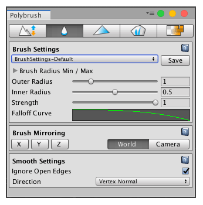
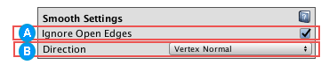

# Smoothing vertices

The **Smooth** tool averages the differences between vertex positions along an axis, which is set by the **Direction** property in [Smooth Settings](#props).  Use this mode to make jagged vertices on the Mesh more uniform.

After sculpting your Mesh, you might need to smooth out hard edges to give it a more natural look.

To use the Smooth tool:

1. Select the Mesh object you want to smooth.
2. Click the **Smooth mesh geometry**  icon in the Mode toolbar to activate Smooth mode.
3. To customize the radius, falloff, and strength (intensity) of the brush, modify the properties in the [Brush Settings](brushes.md) section.
4. To mirror the changes you are applying, set the axes and reference in the [Brush Mirroring](brush_mirror.md) section.
5. To customize the Smooth tool, modify any of the options in the [Smooth Settings](#props) section, which are only available in this mode.
6. Click and drag on the Mesh while holding down the left mouse button to apply Smoothing.

## Smooth Settings

 When the **Ignore Open Edges** property is enabled, Polybrush ignores any vertices on the edge of the Mesh. This is enabled by default.

Disable this property if you want Polybrush to modify all vertices within the radius of the brush. The following image demonstrates the difference:

 Choose how to push or pull the vertices under the brush from the **Direction** drop-down menu. You can choose from these options:

| **Value**         | **Description**                                              |
| ----------------- | ------------------------------------------------------------ |
| **Brush Normal**  | Move vertices in the brush's "up" direction. When the brush hovers over a surface, Polybrush samples the normal of that surface and uses it for Brush Normal.  **Note**: The **Brush Normal is Sticky** property determines whether to keep this normal direction until the next stroke, or to sample a new normal every frame of the stroke. |
| **Vertex Normal** | Vertices move in their own inward or outward directions, which Polybrush always recalculates at each frame. This usually results in an inflated or deflated appearance. This is the default setting.  **Note**: In Smooth mode, Polybrush averages each vertex position with its neighbors (instead of constraining the movement path to the normal, like it does in Sculpt mode).  This is useful to reduce large gaps in vertex positions and to make your Mesh look very smooth. |
| **Global Y Axis** | Move vertices on the y-axis only (up).                       |
| **Global X Axis** | Move vertices on the x-axis only (right).                    |
| **Global Z Axis** | Move vertices on the z-axis only (forward).                  |

> **Tip**: The Global Axis directions are useful for "bulldozing" sections.
