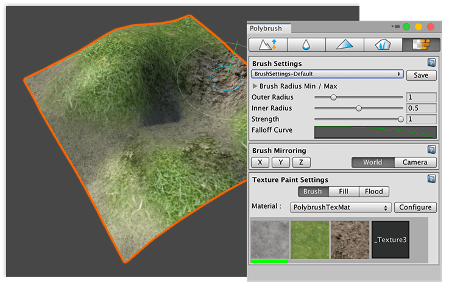
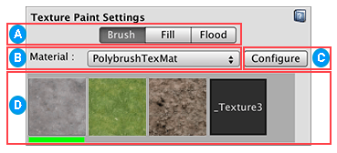
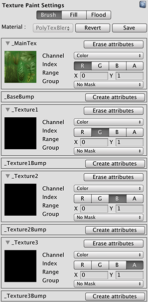

# Texture painting and blending

Use the **Texture** tool to paint and blend multiple Textures on Meshes. 



To blend Textures on a Mesh, make sure that your Material uses a Shader that defines how it blends [Textures](modes_texture.md). For more information on working with Materials and Shaders that support Texture blending, see the following topics:

* [Creating and Using Materials](https://docs.unity3d.com/Manual/Materials.html) for Unity's built-in render pipeline.
* [Getting started with LWRP](https://docs.unity3d.com/Packages/com.unity.render-pipelines.lightweight@latest) (Lightweight Render Pipeline) if you are using a version of the Unity Editor prior to 2019.3, or [Getting started with URP](https://docs.unity3d.com/Packages/com.unity.render-pipelines.universal@latest) (Universal Render Pipeline) if you are using Unity 2019.3 or later.
* [Getting started with High Definition Render Pipeline](https://docs.unity3d.com/Packages/com.unity.render-pipelines.high-definition@latest) (HDRP).

If you hover over a Mesh with an incompatible Shader, Polybrush displays a warning.

Most default Unity Shaders do not support Texture blending, but Polybrush comes with sample Shaders that you can import into your Project. For more information, see [Importing Polybrush Shaders](index.md#import-shaders).

Once your Mesh has the proper Material, you can paint and blend Textures on it:

1. To customize the Texture tool, modify any of the options in the [Texture Paint Settings](#props) section, which are only available in this mode.
2. Select the Mesh object you want to apply Textures to.
3. Click the **Paint textures on meshes** () icon in the Mode toolbar to activate the Texture mode.
4. To customize the radius, falloff, and strength (intensity) of the brush, modify the properties under the [Brush Settings](brushes.md) section.
5. To mirror the changes you are applying, set the axes and reference under the [Brush Mirroring](brush_mirror.md) section.
6. Click on a Texture in one of the slots under the **Texture Paint Settings** section to select it.
7. To paint, hover over the Mesh and left-click where you want to apply the selected Texture.
8. To erase the currently selected Texture, hover over the Mesh and hold the Ctrl key (Command key on macOS) while left-clicking.


## Custom Shaders

Polybrush uses a combination of some or all of the `[ UV0, UV2, UV3, UV3, Color, Tangent ]` attributes to apply Textures. The Shader code defines this information.


## Texture Paint Settings



 Brush style toolbar. Click one of the following buttons to select the way you want Polybrush to apply the Textures:

| **Button application method** | **Description**                                              |
| ----------------------------- | ------------------------------------------------------------ |
| **Brush**                     | Standard brushing style: Polybrush applies Textures smoothly across vertices. |
| **Fill**                      | Polybrush fills in triangles (faces), hard-edged.            |
| **Flood**                     | Polybrush completely fills the Mesh.                         |

 Choose which Material to edit and paint from the **Material** drop-down menu if your Mesh has multiple Materials.

 Select the **Configure** button to [set the Textures on the Material](#config).

 Polybrush automatically detects what Textures are available for each Material and displays them as slots on a selection grid.  

To select a brush Texture to paint onto the Mesh object:

* Click one of the Texture slots in the grid.

	The selected Texture appears with a green bar under the preview.

To remove the selected Texture from the Mesh object:

* Hold the Ctrl key (Command on macOS) while brushing (clicking).


<a name="config"></a>

### Texture Material configuration

Polybrush stores detailed instructions for interpreting Mesh data inside metadata. 

Metadata contains attributes that are stored in the Shader's metadata file. Each entry contains complete information about how Polybrush uses each value in a Shader.

When Polybrush loads a Material in Texture mode, it searches for this metadata. If it can't find any, it prompts you to configure your Shader.

Select the **Configure** button to show the full configuration panel:



Use this configuration panel to [define the attributes](#textattribs) for each Texture slot and link channels (such as `RGB`, `UV1`, and `UV2`) to Texture slots. 

When you finish configuring the Shader, select **Save** at the top of the panel to commit the changes, or **Revert** to discard them.

<a name="textattribs"></a>

#### Defining the attributes

To customize some of the properties defined in a Texture blend Shader, you can set the following attributes:

| **Attribute**            | **Function**                                                 |
| ------------------------ | ------------------------------------------------------------ |
| [Shader property target] | This is the Shader property that these attributes affect.<br /><br />More complex interactions might not map to a single Shader property, so this can be either the name of a Shader property, or a simple description.<br /><br />If this string matches a 2D property in the Shader, Polybrush loads the Material's Texture that matches this property name.  If it does not match a Texture property, this string appears as the preview in the Texture slot. |
| __Channel__              | Choose which Mesh channel to link to the attribute: `Color`, `Tangent`, `UV1`, `UV2`, `UV3`,  or `UV4`. |
| __Index__                | Select which component of the channel the attribute receives data from: `R`, `G`, `B`, or `A`. |
| __Range__                | Set the range as the minimum (**X**) and maximum (**Y**) that the attribute operates in. |
| __Group__                | Choose an attribute group for the Texture slot. <br /><br />Attributes with matching groups affect each other when applied. Use `No Mask` if you want this attribute to always operate independently. |

To remove all of the attributes, click the **Erase attributes** button.

If a Shader property has no attributes defined, the **Create attributes** button appears instead. Select the **Create attributes** button to display a new set of attributes.

### How Polybrush applies Texture data

When you select a Texture in Texture mode, Polybrush sets a new target value for each attribute that matches the selected attributes group. It sets the selected attribute's target value to `Range.max`, while setting all other attributes in the group to their `Range.min` value. Polybrush then applies this new mix of attribute values to the Mesh, and takes into account brush [strength](brushes.md#strength) and [falloff](brushes.md#falloff). 

#### Texture data example

This example assumes you have a Shader with five Textures: one base Texture and four blend Textures. 

This Shader reads Texture blending information from the `mesh.color` channel. 

The final fragment color is built using the following formula:

```c++
// sample the texture
fixed4 col1 = tex2D(_MainTex, i.uv);
fixed4 col2 = tex2D(_Texture1, i.uv) * i.color.y;
fixed4 col3 = tex2D(_Texture2, i.uv) * i.color.z;
fixed4 col4 = tex2D(_Texture3, i.uv) * i.color.w;

fixed4 final_color = lerp(lerp(lerp(col1, col2, i.color.y), col3, i.color.z), col4, i.color.w);
```

In this case, you need to add four Textures to the metadata so that Polybrush can show these entries in the **Texture Palette**. 

All the Texture properties are related: when you set one value to maximum strength, then you should also set the others to minimum strength. To do this, create each of these attributes with the same group, and use these values:

| **Property** | **Channel** | **Component** | **Range** | **Group** |
| ------------ | ----------- | ------------- | --------- | --------- |
| `_MainTex`   | Color       | G             | { 1, 0 }  | 0         |
| `_Texture1`  | Color       | G             | { 0, 1 }  | 0         |
| `_Texture2`  | Color       | B             | { 0, 1 }  | 0         |
| `_Texture3`  | Color       | A             | { 0, 1 }  | 0         |

`_MainTex` and `_Texture1` share a common channel. This is because `_MainTex` doesn't map its strength to a single attribute: its strength is determined by the lack of strength in the other Texture channels.

Set `_MainTex` to use the Color channel and register it to the `G` field. However, instead of setting the strength from 0 to 1 it is from 1 to 0. That means when Polybrush applies `_MainTex` at full strength, the `Color.G` field is 0, and the `Color.B` and `Color.A` fields are also 0 (since their minimum values are 0).