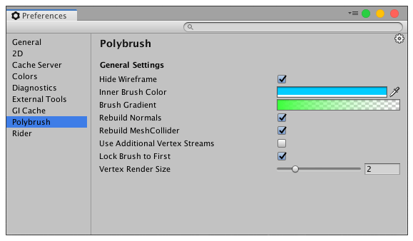

### Preferences

To customize Polybrush, access the **Preferences** window:

* Navigate to __Edit__ &gt; __Preferences__ (Windows) or __Unity__ &gt; __Preferences__ (macOS) from the main menu in Unity and click the **Polybrush** category on the left pane.

The following table describes each setting available for the Polybrush tool:

| **Setting:**                     | **Description:**                                             |
| -------------------------------- | ------------------------------------------------------------ |
| __Hide Wireframe__               | Enable this setting to hide the wireframe of the object underneath the brush (that is, the object the brush is currently hovering over) while painting. The wireframe sometimes makes it hard to see the surface's true shape, so enable this setting to help with detailed modeling and editing.  This setting takes precedence even if you set the [Shading mode to Wireframe](https://docs.unity3d.com/Manual/ViewModes.html). |
| __Inner Brush Color__            | Set the color for the inner ring of the brush and any vertices that appear within. This makes it easier to see where you are making the strongest changes. For example, if you enabled the Sculpt mode, and set its strength (sculpting power) to 1, Polybrush fully modifies everything that appears with this color. |
| __Brush Gradient__               | Set the color for the falloff on the outer ring of the brush and any vertices that appear within. This makes it easier to see the difference in strength radiating outward from the inner radius to the edge of the outer radius. |
| __Rebuild Normals__              | Enable this setting to auto-rebuild Mesh normals while editing. When you enable this setting, every time you make a modification to the Mesh, Polybrush recalculates the normals. |
| __Rebuild MeshCollider__         | Enable this setting to auto-rebuild the MeshCollider while editing. When you enable this setting, every time you make a modification to the Mesh, Polybrush recalculates the collider bounds. |
| __Use Additional Vertex Stream__ | Enable this setting to use the Unity [Additional Vertex Streams](https://docs.unity3d.com/ScriptReference/MeshRenderer-additionalVertexStreams.html) feature by default to apply Mesh changes. Enabling this option might improve performance over applying changes directly from the **Polybrush Mesh** component.   To override this default for any Mesh, use the Polybrush Mesh component's [Apply as](component.md#apply-as) property. |
| __Lock Brush to First__          | Enable this setting to prevent any other adjacent Meshes from intercepting any brush strokes. Disable this setting to apply brush strokes across multiple Meshes. |
| __Vertex Render Size__           | Set the size of the vertices shown under the brush.          |
