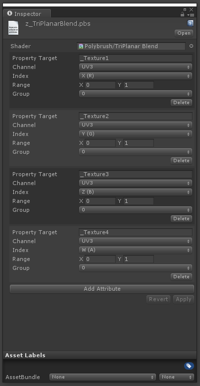
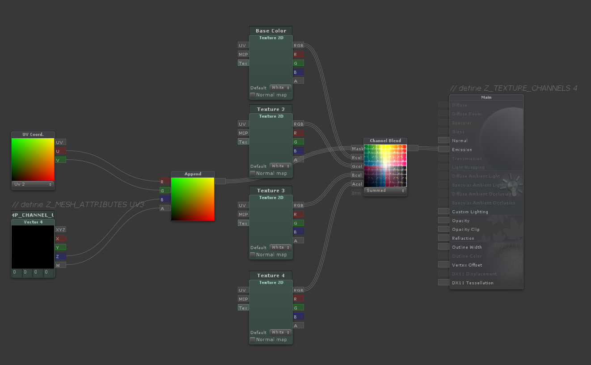
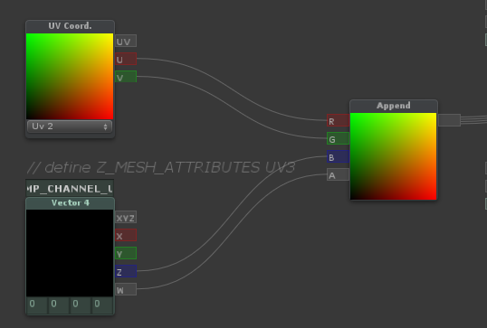

# Writing Texture blend Shaders

[Placeholder text from previous documentation]

Constructing a shader that is compatible with **Polybrush**'s **Texture Paint Mode** is very simple.  You can either write your code by hand, or use **ShaderForge**.

**Polybrush** will pass texture blending information to the shader using some combination of mesh attributes (ex; via color, tangent, uv0, uv2, etc).

There are two methods for passing information about how a shader uses mesh data: 

- By defining in shader code which mesh channels to look for data in (UV, Color, etc)
- By creating a separate metadata file that stores per-attribute information

If your shader just wants to map `Color.R` to `_Texture1`, `Color.G` to `_Texture2`, etc go with the first option.  If your shader has more complex interactions with attribute information, use the metadata method.

## Defining Channel Data in Shader Code (**Legacy**)

If your shader simply blends between textures using normalized values set in a mesh array, you can use this method to make the shader compatible with Polybrush.

1. Somewhere in the shader you must define how many textures are used: `define Z_TEXTURE_CHANNELS 8`
2. Somewhere in the shader the mesh attributes used must be defined: `define Z_MESH_ATTRIBUTES COLOR UV UV3`
	The order in which the mesh attributes are defined also tells **Polybrush** which `Texture` inputs belong to which attribute.  For example, `define Z_MESH_ATTRIBUTES UV0 UV3 UV4` tells **Polybrush** that the first 4 textures should map to the 4 values in each vertex `uv0` property, the next 4 textures belong to `uv3`, and so on.

The available mesh attributes values are `UV0, UV2, UV3, UV4, COLOR, TANGENT`.  Each value should only be used at most once.

**Polybrush** accesses these statements by searching the shader source, so they may be either provided in a comment or defined.

```c++
#define Z_TEXTURE_CHANNELS 8
// is the same as
// define Z_TEXTURE_CHANNELS 8
```

Here's what this could look like in shader code (boring bits omitted)

```c++
Properties
{
	_MainTex ("Texture", 2D) = "white" {}
	_Texture1 ("Texture 1", 2D) = "white" {}
	_Texture2 ("Texture 2", 2D) = "white" {}
	_Texture3 ("Texture 3", 2D) = "white" {}
	_Texture4 ("Texture 4", 2D) = "white" {}
	_Texture5 ("Texture 5", 2D) = "white" {}
}
SubShader
{
	Pass
	{
		// Tell Polybrush that this shader supports 6 texture channels (Texture, Texture 1, so on)
		#define Z_TEXTURE_CHANNELS 6

		// Tells Polybrush that the shader expects data in the uv3 and uv4 channels
		// (4 components in uv3, 2 in uv4)
		#define Z_MESH_ATTRIBUTES UV3 UV4

		struct appdata
		{
			// local position
			float4 vertex : POSITION;
			// the texture coordinate
			float2 uv : TEXCOORD0;
			// float2 uv1 : TEXCOORD1; // not used (this would be mesh.uv2)
			// mesh.uv3 data
			float4 uv2 : TEXCOORD2;
			// mesh.uv4 data
			float4 uv3 : TEXCOORD3;
		}

		etc...
```

In this example **Polybrush** will show 6 textures in the palette and map each texture's strength to `mesh.uv.xyzw` and `mesh.uv3.xy` respectively.

Check out the shader *UnlitTextureBlend.shader* for a simple working example.

## MetaData File

**Polybrush** can store fine-grained instructions for interpreting mesh data in the form of a metadata file.  A metadata file is composed of a shader reference (pointing to the shader it describes) and a list of `AttributeLayout` entries.  Each entry contains all the necessary information about how a value is used in a shader for **Polybrush** to work with.

When **Polybrush** loads a material into **Texture Mode** it will first search for an accompanying `ShaderName.pbs.json` file, then try to fall back on the Legacy method (searching for `Z_DEFINE_MESH_ATTRIBUTES` in shader source).

### Creating MetaData

To create a new **Polybrush** metadata file:

- Select the shader you want to work with.
- Right click (Option click Mac) the Shader and select `Create/Polybrush/Shader MetaData`.

By default **Polybrush** creates the new file using the name of the selected shader, placing it in the same directory.  This is where **Polybrush** will look for metadata.  To specify a different name or path, in the shader add the following comment:

```
// Z_SHADER_METADATA MyMetaDataFolder/SomeOtherName.pbs.json
```


The path provided after `Z_SHADER_METADATA` is relative to the directory of the shader.

### Editing MetaData

Mercifully, you do not have to write this metadata by hand (though you can if you'd like to).



- **Property Target** - The shader property that this attribute will affect.  

	More complex interactions may not map to a single property, so this field may be either the name of a property, or a simple description.

	If the string provided to this field matches a `2D` property in the shader, **Polybrush** will load the material's texture matching this property name.   If it does not match a texture property, this string will be shown as the preview in the texture selection well.

- **Channel** - The mesh channel that this attribute will draw from.
- **Index** - Which component of the channel this attribute receives data from.
- **Range** - The range (x is min, y is max) that this attribute will operate in.
- **Group** - Attributes with matching groups will affect one another when applied.  Use `No Mask` to mark that this attribute will always operate independently.

### How Polybrush Applies Texture Data

When a texture is selected in **Texture Mode**, **Polybrush** sets a new target value for each attribute matching the selected attributes **group**.  The selected attribute has its target value set to **Range**.max, while all other attributes in the group are set to their **Range**.min value.  **Polybrush** then applies this new mix of attribute values to the mesh, taking into account brush strength and falloff.

#### A Simple Example

Say you have a shader with 5 textures; a base texture and 4 blend textures.  This shader reads texture blending information from the `mesh.color` channel.  The final fragment color is built using the following formula:

```
// sample the texture
fixed4 col1 = tex2D(_MainTex, i.uv);
fixed4 col2 = tex2D(_Texture1, i.uv) * i.color.y;
fixed4 col3 = tex2D(_Texture2, i.uv) * i.color.z;
fixed4 col4 = tex2D(_Texture3, i.uv) * i.color.w;

float snowMix = i.color.x * ((cnoise(i.uv * _SnowTiling) + 1) * .5);
fixed4 final_color = lerp(lerp(lerp(col1, col2, i.color.y), col3, i.color.z), col4, i.color.w);
final_color = lerp(final_color, _SnowColor, snowMix);
```

In this case you'll want **Polybrush** to show 5 entries in the **Texture Palette**: 4 textures and "Snow".  This means the metadata needs 5 entries.

All the texture properties are related, meaning when one value is set to maximum strength the others should be set to minimum strength.  To do this, create each for these attributes with the same group.

The attribute values are set like so:

| Property 	| Channel 	| Component 	| Range 	| Group |
|-|-|-|-|-|
|_MainTex 	| 	Color 	| G 			| { 1, 0 } 	| 0 |
|_Texture1 	|	Color 	| G 			| { 0, 1 } 	| 0 |
|_Texture2 	|	Color 	| B 			| { 0, 1 } 	| 0 |
|_Texture3 	|	Color	| A 			| { 0, 1 } 	| 0 |
|Snow 		|	Color	| R 			| { 0, 1 } 	| No Mask |

You may have noticed that `_MainTex` and `_Texture1`  share a common channel.  The reason is that `_MainTex` is special in that it does not map it's strength to a single attribute, rather, its strength is determined by the lack of strength in the other texture channels.  

To accomplish this, we set `_MainTex` to use the `Color` channel and register it to the `G` field.  However, instead of setting the strength from 0 to 1 it is from 1 to 0.  That means when **Polybrush** applies `_MainTex` at full strength the `Color.G` field will be 0, and the `Color.B` and `Color.A` fields will also be 0 (since their min values are 0).

Snow is also a special case.  Since it is a generated effect in the shader it does not map to a texture property.  **Polybrush** will display the name "Snow" for this value.  By setting the group to "No Mask" we're telling **Polybrush** that this value should be modified independent of all other attributes.  That means when you're applying Snow at full strength all other attributes will remain unaffected.

## With ShaderForge

#### Post-Processing

Shaders built with **ShaderForge** require some additional work to be compatible with **Polybrush**.  Fortunately through some post-processing this process is extremely simple.  In short, **Polybrush** will automatically listen for changes to any shader with the suffix *_SfSrc*, then make some changes to the source code and compile a new shader right next to it (omitting the suffix so you aren't confused).

For example, if you have *MyNeatoShaderForgeShader_SfSrc.shader* it will be compiled and renamed to *MyNeatoShaderForgeShader.shader*.  Use this shader in your game (not the suffixed one!).

Similar to writing shader code, you need to define how many textures are used and what mesh attributes data is provided in.  Usually this means as a comment on one of the nodes (right click and select "Edit Comment").

It is required that all ShaderForge shaders have the following two lines present in node comments:

1. *define Z_TEXTURE_CHANNELS 8*

	Where the last number is the number of textures used.


2. *define Z_MESH_ATTRIBUTES UV3 UV4*

	Where the values following Z_MESH_ATTRIBUTES is the mesh properties that are accessed.  Available values are `UV0, UV2, UV3, UV4, COLOR, TANGENT`.

In addition, shaders must be named with the suffix *_SfSrc* (ex, *MySimpleBlendShader_SfSrc.shader*).  This lets **Polybrush** know that this shader requires some post-processing.

The **Shader Settings / Path** must be set to *Hidden* (ex, *Hidden/MyShader*).  **Polybrush** will automatically detect this and remove the *Hidden* part from the path when compiling the new shader.  If you're having issues with black triangles on a mesh, check that the shader has **Hidden/** in it's path.

Here is a basic 4 texture blend shader in ShaderForge.  This shader blends the 4 textures using `mesh.uv3` as input.  Note the comments *Z_TEXTURE_CHANNELS 4* on the `Main` node and *Z_MESH_ATTRIBUTES UV3* on the `Vector4 Property` node.




#### Accessing Vector4 UVs

Due to a limitation in ShaderForge, accessing UV data as `Vector4` types requires some extra work.  To read a UV as a `fixed4` in graph language, first

1. Create a `UV Coord.` node matching the channel you would like to read blend information from.
2. Create a `Vector4 Property` node named `TEMP_CHANNEL_UV0` (or `TEMP_CHANNEL_UV1`, or `TEMP_CHANNEL_UV2` etc, where the final number matches the channel specified in the `UV Coord.` node).
3. Create an `Append` node and connect the `uv.u`, `uv.v`, `TEMP_CHANNEL_0.z` and `TEMP_CHANNEL_0.w`.  It is important that you not swizzle the `UV Coord.` input.
4. Use the `Append` output as though it was the `uv0` channel.



In shader code, the texture coordinates are always zero indexed, where in Unity you may be used to seeing the `uv0` channel called simply `uv` and the `uv1` channel called `mesh.uv2`.

If you're confused, here's a graph mapping the `mesh` property to it's shader counterpart.

| Mesh | Shader | Vector4 Node Name |
| - | - | - |
| `mesh.uv` or `mesh.uv2` | `uv0` | `TEMP_CHANNEL_UV0` |
| `mesh.uv2` | `uv1` | `TEMP_CHANNEL_UV1` |
| `mesh.uv3` | `uv2` | `TEMP_CHANNEL_UV2` |
| `mesh.uv4` | `uv3` | `TEMP_CHANNEL_UV3` |


## F.A.Q.

### Texture Palette Doesn't Match What's Painted

Make sure that the properties are listed in the correct order (they will be matched sequentially to the `Z_MESH_ATTRIBUTES` list).
