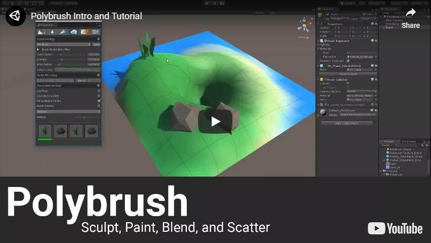

# Table of Contents

- [About](#about)
- [Installation](#installation)
- [Upgrading Polybrush](#upgrading-polybrush)
  - [Addition Vertex Streams - Batch update to new format](#batch-update-z_additionalvertexstreams)
- [Integrations](#integrations)
  - [ProBuilder 4](#probuilder-4)
- [Questions, feedbacks](#contact)

# About

Polybrush is a mesh painting, sculpting, and geo-scattering tool for **Unity 2018.3 and later**.

> It is only compatible with **Unity** and **ProBuilder 4 meshes**. If you would like to work on Unity terrains, please use the dedicated tool instead.

Polybrush full documentation is available [here](https://unity-technologies.github.io/procore-legacy-docs/polybrush/polybrush-gh-pages/).

# Installation

From version 1.0 and onwards, Polybrush will only be available from the Package Manager.

To install this package, follow the instructions in the [Package Manager documentation](https://docs.unity3d.com/Packages/com.unity.package-manager-ui@latest/index.html).

# Upgrading Polybrush

If you have been using a version of Polybrush prior 1.0, please thoroughly follow these instructions:

   1. Close Unity.
   2. Find the `/ProCore/Polybrush/` folder. It should be located at `<project_assets_folder>/ProCore/Polybrush/`.
   3. Delete the folder.
   4. Open Unity.
   5. Install last version of Polybrush from Package Manager (see [Installing Polybrush](#installing))

As `Z_AdditionalVertexStreams` is now deprecated, Polybrush 1.0 will automatically replace them by the new component `PolybrushMesh` the first time you will be hovering an object with one of Polybrush's tools enabled.

### Batch update Z_AdditionalVertexStreams

**Note:** please skip this section if you haven't been using Additional Vertex Streams with previous versions of Polybrush.

In Polybrush 1.0, a menu item is available in `Tools > Polybrush > Upgrade Z_AdditionalVertexStreams`.

When used, it will go through every scene currently loaded in the Editor and look for `Z_AdditionalVertexStreams` components (even on inactive gameobjects). When one is found, it will be replaced by its new equivalent `PolybrushMesh` component. The internal data is converted during the process so you don't loose anything. Expect your scenes and objects to be marked as dirty, so don't forget to Save after this process.

### Texture Blend mode: update shaders configuration

As of Polybrush 1.0, shader setup (connecting channels with textures) is done directly within the Texture Blending panel of Polybrush. The setup info is stored in the shader's meta file.

We provide a simple way to convert the existing `.pbs.json` files to the new format:

   1. Select your shaders in the Project View.
   2. Go to `Tools > Polybrush > Update Shader Meta`.

This update process above will move the data from the `.pbs.json` into the shader `.meta file.` and delete the old `.pbs.json` file.

# Integrations
### ProBuilder 4

Polybrush 1.0 is fully compatible with ProBuilder 4. To use it, you only need to import ProBuilder 4 via the Package Manager. Interacting with Unity meshes and ProBuilder objects will work identically.

# Contact

Feel free to post your questions and feedbacks on the [World Building](https://forum.unity.com/forums/world-building.146/) forum.
